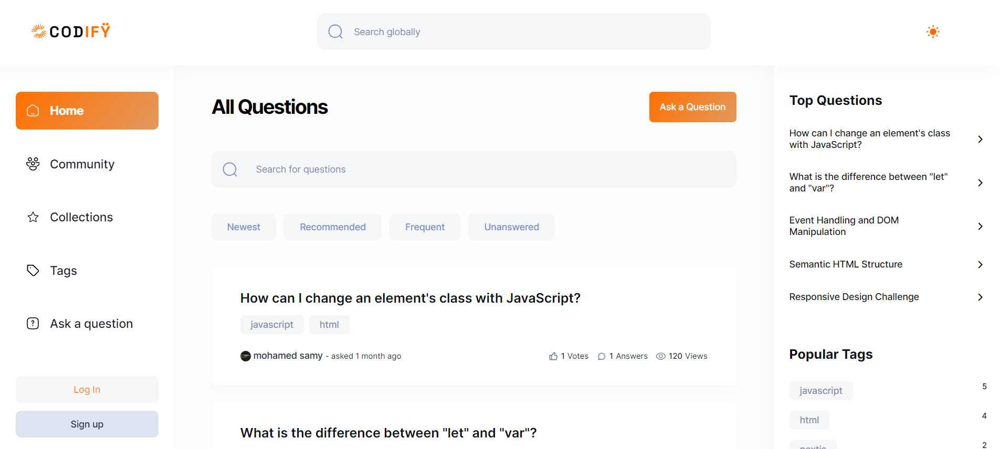

# Codify

Codify - the ultimate community-driven platform for programming enthusiasts! 🚀

Built with cutting-edge technologies including Next.js, TypeScript, MongoDB, Zod, Clerk, Tailwind CSS, and Shadcn, Codify is more than just a Q&A platform—it's a vibrant hub where developers connect, learn, and grow together.

Key Features:

1. A recommendation system for posts.
2. Badge & Reputation System.
3. Local & Global Search.
4. Views and Voting Mechanism.
5. Filter and Pagination for almost all pages.

## Getting Started

To get started with Codify, follow these steps:

1. Clone this repository to your local machine.
2. Run `npm install` to install the required dependencies.
3. Add the API keys to .env file.
4. Run `npm run dev` to start the web server. 
